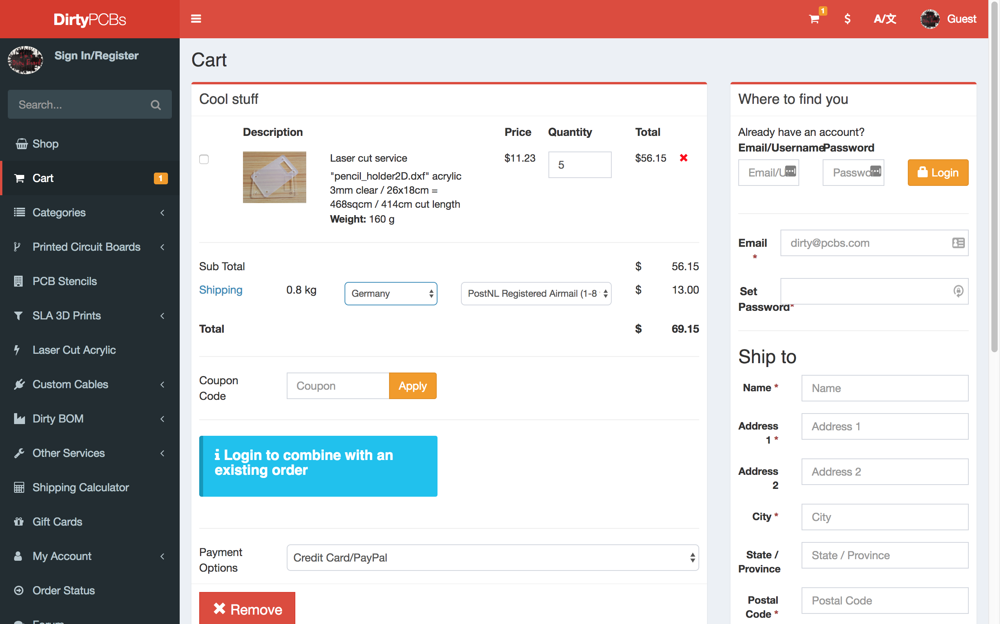
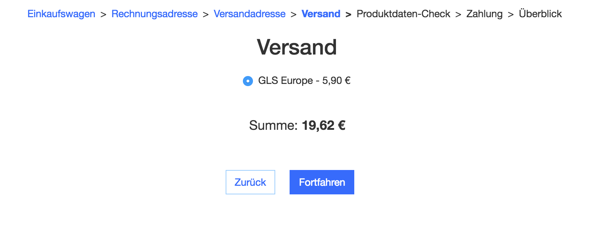
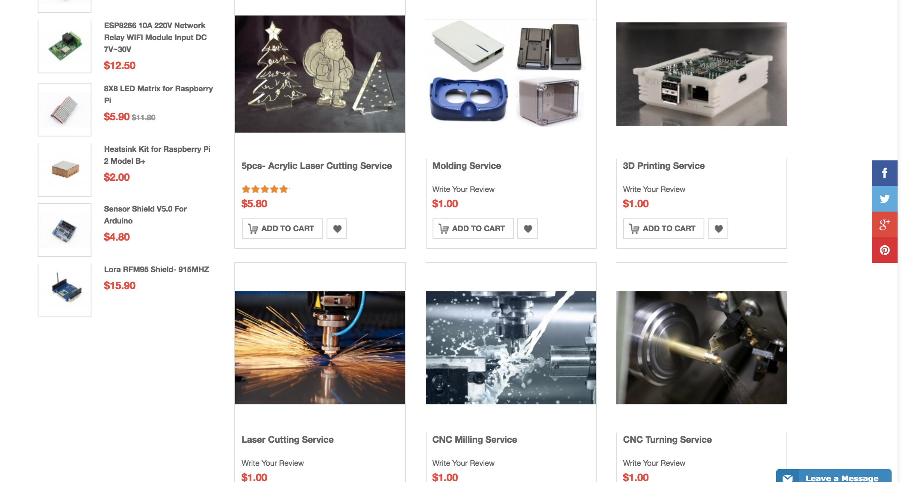
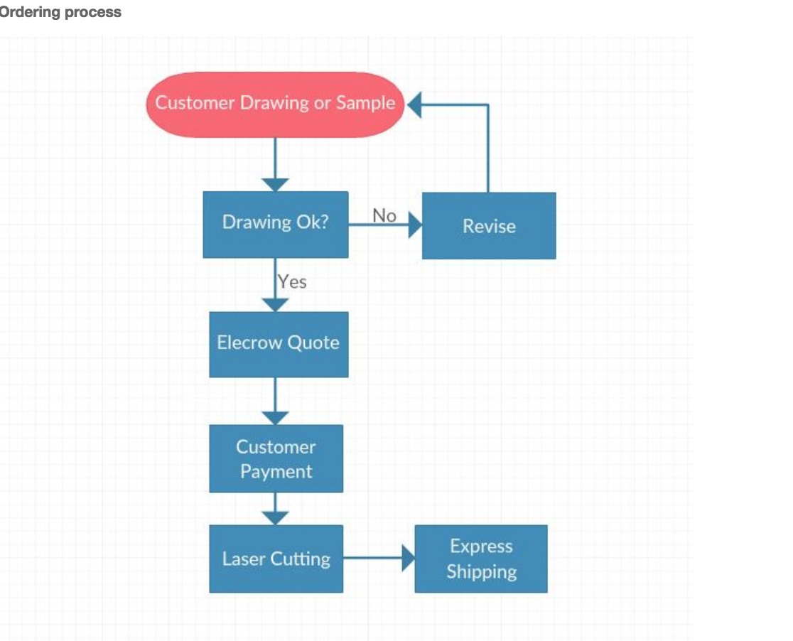

# pencil-holder

At the [anorg kit sprint](http://wiki.sgmk-ssam.ch/wiki/KitSprint_ANORG_2018#What_is_it_about) on 24. and 25th of February 2018 I first used time to 3D Model a pencil holder in Fusion 360 I downloaded in 2014 and adapted to 3mm plywood. I even laser cuttet the it and sold at the first Maker Faire in Paris 2014.

I always wondered how this Pencil Cube was designed and I finally managed to do it with Fusion 360. It was quite a challange but I tought me a couble of new tricks of fusion. 

You can lay down the file flat with a Nesting tool and projecting all the sides on a sketch. 

The pencil holder is paremetric in the length, witdh and the thickness of the material but I have not figured out how to make the number of holding spots. 
I want to also code this holder in openSCAD soon.

I also checked out Dirty PCB to find out if they provide laser services and found out that they cut 3mm plexi.

5 pieces will cost me with shipping $ 69.15 from [dirtypcbs.](https://dirtypcbs.com/store/lasercut)

 

Then I also checked as a reference the lasercutting service [formulorr.de](http://www.formulor.de)

They also have [great guide](http://www.formulor.de/uploadHelp/inkscape) on how to prepare your file for lasercutting in inkscape, illustrator and corel draw. 

I checked and one box would be 19,62 € plus shipping.

Then Radomir suggested a chinese services called [elecrow](https://www.elecrow.com) were you can have your pcbs made but also they will lasercut, make a mold for you or cnc. 

I also send the design to service@elecrow.com and they will come back with a offer. This is the process. 

Lets get into PCB making now! The goal is to have a finished PCB to be send to China at 6 pm. 