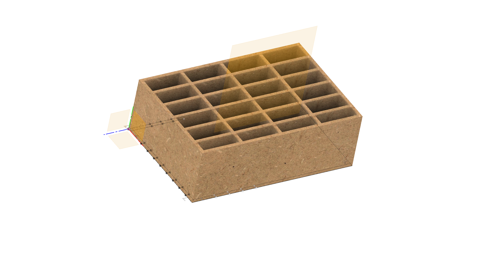

# parametric pencil-holder

At the [anorg kit sprint](http://wiki.sgmk-ssam.ch/wiki/KitSprint_ANORG_2018#What_is_it_about) on 24. and 25th of February 2018 I used the time to 3D Model a pencil holder in Fusion 360 I downloaded in 2014 and adapted to 3mm plywood. I even laser cuttet it back then and sold it at the first Maker Faire in Paris 2014.

I always wondered how this mdf pencil cube was designed and I finally managed to do it with Fusion 360 this weekend. It was quite a challenge but I tought me a couple of new tricks of fusion. Many od

Thats like it looks like if you change the sides. 

You can lay down the file flat with a Nesting tool and projecting all the sides on a sketch. 

The pencil holder is paremetric in the length, witdh and the thickness of the material but I have not figured out how to make the number of holding spots. 
I want to also code this holder in openSCAD soon.

I also checked out Dirty PCB to find out if they provide laser services and found out that they cut 3mm plexi.

# Design + make this box yourself

* [get Fusion360:](https://www.autodesk.de/products/fusion-360/students-teachers-educators) its free for students and hobbyists
* [Nesting tool](https://github.com/tapnair/NESTER)
* download the model, I continue working on it --> [http://a360.co/2oGIFyE]()
* open Fusion and upload to your projects
* adjust paremeters
* mdf or other material + lasercutter
* laser cutting service (see below)

# Laser cutting services in China and Germany

Sure you can go on and lasercut this box yourself but I wanted to explore if there is a way that somebody is doing it for you. Also there might be many people that do not have access to a laser cutter. 

5 pieces will cost me with shipping $ 69.15 from [dirtypcbs.](https://dirtypcbs.com/store/lasercut)

 

Then I also checked as a reference the lasercutting service [formulor.de](http://www.formulor.de) in Germany.

They also have [great guide](http://www.formulor.de/uploadHelp/inkscape) on how to prepare your file for lasercutting in inkscape, illustrator and corel draw. 

I checked and one box would be 19,62 € plus shipping.

Then Radomir suggested a chinese services called [elecrow](https://www.elecrow.com) were you can have your pcbs made but also they will lasercut, make a mold for you or cnc. 

I also send the design to service@elecrow.com and they will come back with a offer. This is the process. 

#How you can help?

* make the model in an opensource software like openscad, FreeCad, antimony, blender
* design the model in onshape
* design the model in solidworks
* I still have some problems that one extrude is not selecting the whole profil

#Contact

Andreas Kopp

[andreas@erfindergarden.de](mailto:andreas@erfindergarden.de)

#Credits

This design inspired me 2014 to get into laser cutting. The design was from [YamashitaKen](https://www.thingiverse.com/YamashitaKen/about) which I adapted in 2014 to be flat. 

#Licence

This project is [Public Domain (CC0 1.0 Universal (CC0 1.0)](https://creativecommons.org/publicdomain/zero/1.0/). Nobody cares what you do with this stuff.

For more information, see [license](license.md). 