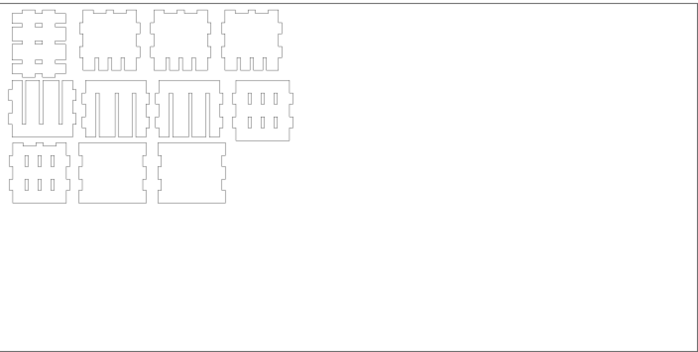

# pencil-holder

At the [anorg kit sprint](http://wiki.sgmk-ssam.ch/wiki/KitSprint_ANORG_2018#What_is_it_about) on 24. and 25th of February 2018 I first used time to 3D Model a pencil holder in Fusion 360 I downloaded in 2014 and adapted to 3mm plywood. I even laser cuttet the it and sold at the first Maker Faire in Paris 2014.

I always wondered how this Pencil Cube was designed and I finally managed to do it with Fusion 360. It was quite a challange but I tought me a couble of new tricks of fusion. 

You can lay down the file flat with a Nesting tool and projecting all the sides on a sketch. 

The pencil holder is paremetric in the length, witdh and the thickness of the material but I have not figured out how to make the number of holding spots. 
I want to also code this holder in openSCAD soon.

Lets get into PCB making now! The goal is to have a finished PCB to be send to China at 6 pm. 